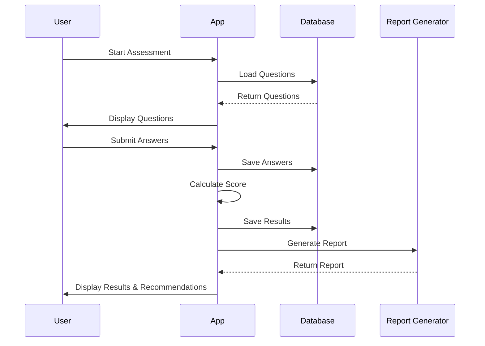
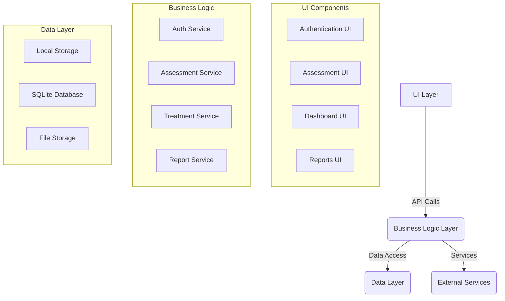
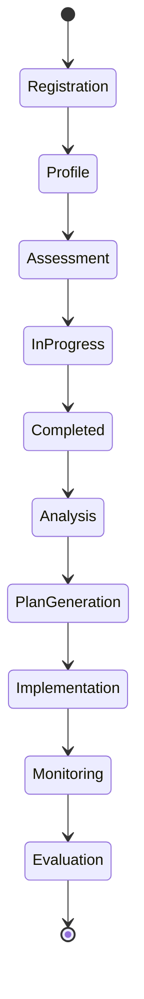

# المخططات التقنية لتطبيق "خُطى"

## Class Diagram

```mermaid
classDiagram
    class User {
        +String userId
        +String email
        +String password
        +DateTime createdAt
        +registerUser()
    }

    class Child {
        +String childId
        +String parentId
        +String name
        +int age
        +String gender
        +getAssessments()
    }

    class Assessment {
        +String assessmentId
        +String childId
        +DateTime date
        +String assessorType
        +calculateScores()
        +generateRecommendations()
    }

    class Result {
        +String resultId
        +String assessmentId
        +String category
        +int rawScore
        +int tScore
        +String interpretation
    }

    User "1" -- "*" Child
    Child "1" -- "*" Assessment
    Assessment "1" -- "*" Result

## Use Case Diagram

```mermaid
graph TD
    A[Parent/Guardian] -->|Register| B(Create Account)
    A -->|Login| C(Access Dashboard)
    C -->|Add Child| D(Child Profile)
    D -->|Start Assessment| E(Conners Assessment)
    E -->|Complete| F(View Results)
    F -->|Generate| G(Treatment Plan)
    G -->|Track| H(Daily Activities)
    H -->|Update| I(Progress Tracking)
    I -->|Generate| J(Progress Reports)
    A -->|View| K(Historical Data)
    A -->|Manage| L(Settings)
```
graph TD
    A[Parent/Teacher] -->|Register| B(Create Account)
    A -->|Login| C(Access Dashboard)
    C -->|Start Assessment| D(Answer Questions)
    D -->|Submit| E(Calculate Results)
    E -->|View| F(Analysis & Recommendations)
    F -->|Track Progress| G(Compare Results Over Time)

## Sequence Diagram - Assessment Flow



## Component Diagram



## State Diagram - Assessment Process


